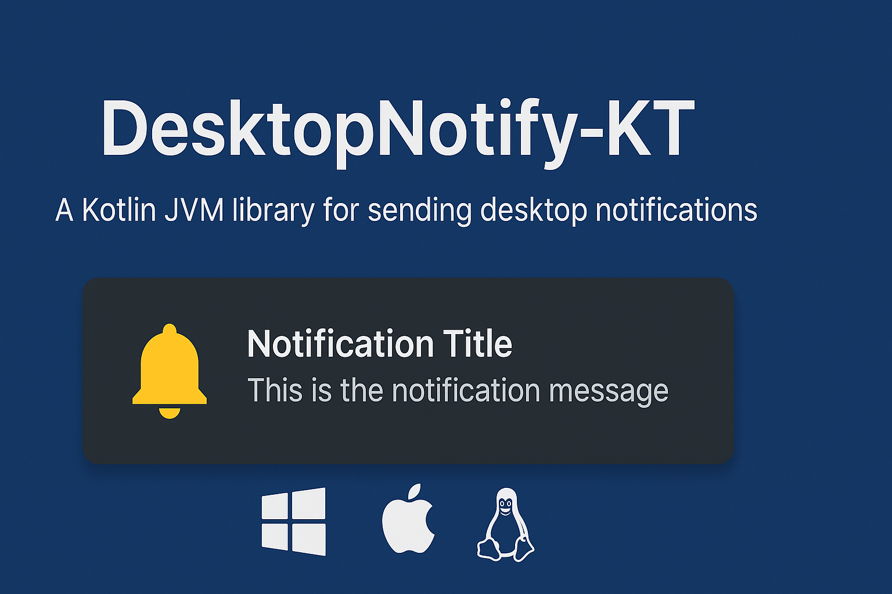

# DesktopNotify-KT

<p align="center">
  
</p>

<p align="center">
  <a href="https://central.sonatype.com/artifact/io.github.kdroidfilter/knotify"></a>
  <a href="LICENSE"></a>
  <a href="#"></a>
</p>


## 🚀 Overview

⚠️ **Warning**: This library is highly experimental, and bugs may occur. The API is subject to change.

This guide explains how to use the library in your KMP project.

## 📦 Installation

To use this library, add the following dependency to your Kotlin project:

```kotlin
implementation("io.github.kdroidfilter:knotify:<version>")
```

## ✨ Usage Example

The library uses a Kotlin DSL to define notifications in a declarative way, without the usual boilerplate code. Here are examples of how you can create and manage notifications:

### Creating and Sending a Notification Later

```kotlin
// Create a notification
val myNotification = notification(
    title = "Notification from Screen 1",
    message = "This is a test notification from Screen 1",
    largeImage = Res.getUri("drawable/kdroid.png"),
    smallIcon = Res.getUri("drawable/small_icon.png"),
    onActivated = { Log.d("NotificationLog", "Notification 1 activated") },
    onDismissed = { reason -> Log.d("NotificationLog", "Notification 1 dismissed: $reason") },
    onFailed = { Log.d("NotificationLog", "Notification 1 failed") }
) {
    button(title = "Show Message from Button 1") {
        Log.d("NotificationLog", "Button 1 from Screen 1 clicked")
        onShowMessage("Button 1 clicked from Screen 1's notification")
    }
    button(title = "Hide Message from Button 2") {
        Log.d("NotificationLog", "Button 2 from Screen 1 clicked")
        onShowMessage(null)
    }
}

// Send it when needed
myNotification.send()

```

### Creating and Sending a Notification with Reference

```kotlin
// Send a notification immediately but keep a reference to it
val myNotification = sendNotification(
    title = "Immediate Notification with Reference",
    message = "This notification is sent immediately but can be manipulated later",
    smallIcon = Res.getUri("drawable/small_icon.png"),
    onActivated = { Log.d("NotificationLog", "Notification activated") }
) {
    button(title = "Click Me") {
        Log.d("NotificationLog", "Button clicked")
    }
}

// Hide it later when needed
myNotification.hide()
```

With this DSL approach, you can create rich and interactive notifications while keeping the code clean and readable. The library handles all the necessary details, allowing you to focus on your app's core logic.


This code helps ensure that your app properly manages permissions, updating the notification state as permissions are granted or denied.

### Configure optional parameters

You may need to set a default application name and icon for notifications.

- Default application name is the first opened Window title or `"Application"` if there is no window or if it's title is an empty string.
- Default is null so no icon will be displayed or must be defined for every notification.

The notification initialization can be done in the `main` function.

```kotlin
NotificationInitializer.configure(
    AppConfig(
        appName = "My awesome app",
        smallIcon = Res.getUri("drawable/kdroid.png"),
    )
)
```

## ⭐ Features

- **Rich Interactive Notifications**: Use a Kotlin DSL to create rich notifications with multiple actions, images, and buttons.
- **Callbacks for User Interaction**: Handle user actions such as `onActivated`, `onDismissed`, and `onFailed` to add interactivity to your notifications.
- **Custom Actions**: Add buttons with custom actions to your notifications, such as showing or hiding messages.
- **Button Support**: Notifications can include interactive buttons, allowing users to take specific actions directly from the notification.
- **Cross-Platform Compatibility**: Seamless integration across Linux, Windows, and macOS with platform-specific considerations.

## 🎨 KNotify Compose

This module extends the KNotify library to support Compose UI elements in notifications.

### Features

- Render Composable UI elements as notification images
- Use the same familiar API as the core KNotify library
- Seamlessly integrate your Compose UI with desktop notifications

### Installation

To use the Compose extension, add the following dependency to your Kotlin project:

```kotlin
implementation("io.github.kdroidfilter:knotify-compose:<version>")
```

### Usage

```kotlin
// Create a notification with Composable elements as the large image and small icon
val notification = notification(
    title = "Hello from Compose",
    message = "This notification has Compose UI elements as its images",
    largeIcon = {
        // Your Composable UI for large image here
        // For example, a blue circle with text "KN" in the center
        // IMPORTANT: Always use modifier.fillMaxSize() for proper rendering
        Box(modifier = Modifier.fillMaxSize()) {
            // Your content here
        }
    },
    smallIcon = {
        // Your Composable UI for small icon here
        // This will be rendered at a smaller size (typically 64x64)
        // IMPORTANT: Always use modifier.fillMaxSize() for proper rendering
        Box(modifier = Modifier.fillMaxSize()) {
            // Your content here
        }
    }
)

// Send the notification
notification.send()

// Or create and send in one step
sendNotification(
    title = "Hello from Compose",
    message = "This notification has Compose UI elements as its images",
    largeIcon = {
        // Your Composable UI for large image here
        // IMPORTANT: Always use modifier.fillMaxSize() for proper rendering
        Box(modifier = Modifier.fillMaxSize()) {
            // Your content here
        }
    },
    smallIcon = {
        // Your Composable UI for small icon here
        // IMPORTANT: Always use modifier.fillMaxSize() for proper rendering
        Box(modifier = Modifier.fillMaxSize()) {
            // Your content here
        }
    }
)
```

> **Important Note**: When using Composable UI elements in notifications, always use `modifier.fillMaxSize()` to ensure proper rendering. Without this modifier, the content may not display correctly.

## 📸 Screenshots

### Windows


### MacOS


### Gnome (Linux)


### KDE (Linux)


## 📜 License

The DesktopNotify-KT Library is distributed under the [MIT License](LICENSE).

## 🤝 Contributing

If you would like to contribute, feel free to submit issues or pull requests on the [GitHub repository](https://github.com/kdroidFilter/ComposeNativeNotification).

Feel free to reach out for support or additional questions regarding implementation.
